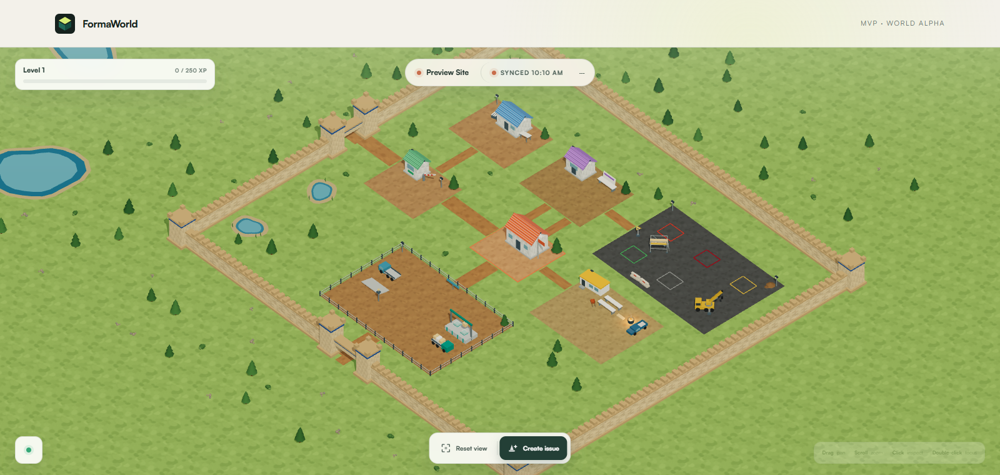

# FormaWorld



<sub>The compound with no project loaded. Signing in fills those districts with
your project's real records — this shot was taken without an Autodesk session,
so it shows the world's geometry and nothing of anybody's data.</sub>

A live, isometric spatial interface for an Autodesk Forma project. Sign in with
your Autodesk account, pick a project, and its real Assets, Issues, Documents,
Forms, RFIs and project members become a construction site you can look at:
material stacked in yards, issues coned off in bays, RFIs on a notice wall, and
the project's actual members walking the compound.

Everything in the world is a real APS record. Nothing is mocked, nothing is
seeded, and a record you can click can always be traced back to the Autodesk
record it came from.

## What it does

- **Reads** Assets, Issues, Documents, Forms, RFIs, project members and the
  documented relationships between them.
- **Holds several projects at once.** Pick up to six from a hub and each becomes
  its own walled compound on the same ground, so a portfolio can be read in one
  frame. Clicking any record still opens the real thing behind it.
- **Places** them by their authoritative APS state — an asset's status decides
  which lane of the material yard it stands in, so a status change in Forma
  moves the object in the world.
- **Writes** back: create a real Issue from the world behind an explicit
  confirmation step, and change supported state on records that allow it.
- **Reconciles** every 30 seconds, backing off to 120 in a hidden tab, and
  refreshing immediately when the tab returns or the network reconnects.
- **Remembers** what belongs to you rather than to the project: your level, the
  digest lines you have answered, and the state your last visit ended on.

## Requirements

- Node.js 22 or newer (24 recommended, and what the Docker image uses).
- An Autodesk Platform Services account.
- An Autodesk Forma / Autodesk Construction Cloud project you actually have
  access to. FormaWorld only ever shows what your own Autodesk user can see.

## Setting up your APS application

1. In the [APS developer portal](https://aps.autodesk.com/myapps), create an
   application of type **Traditional Web App**.
2. Enable the APIs it needs: **Data Management**, **Autodesk Construction Cloud
   (Issues, Forms, RFIs, Admin)** and **Assets**.
3. Register the callback URL **exactly** as your deployment will use it —
   scheme, host and port all have to match:
   - local: `http://localhost:3000/api/auth/callback`
   - hosted: `https://your-host/api/auth/callback`
4. Note the **Client ID** and **Client Secret**.
5. For Autodesk Docs / ACC hubs that require it, an account administrator must
   also add the Client ID under **Hub Admin → Custom Integrations**. Without
   this step your hubs and projects come back empty even though sign-in works.

### Optional: `user-profile:read`

FormaWorld saves your progress against your Autodesk account when it can read
who you are, so your level follows you to another browser or machine. That
needs the `user-profile:read` scope. It is **not** requested by default,
because asking for a scope your application is not registered for makes the
whole sign-in fail. To enable it, grant the scope to your APS application and
set `APS_EXTRA_SCOPES=user-profile:read`.

Without it, everything still works — progress is stored against a long-lived
cookie and stays with that one browser.

## Running it locally

```bash
git clone <your fork or this repository>
cd formaworld
npm install
cp .env.example .env.local     # then fill it in
npm run dev
```

Open <http://localhost:3000>.

`.env.local` needs at minimum:

| Variable | What it is |
|---|---|
| `APS_CLIENT_ID` | From your APS application |
| `APS_CLIENT_SECRET` | From your APS application |
| `APS_CALLBACK_URL` | Must match the registered callback URL exactly |
| `SESSION_SECRET` | 32+ random characters — `openssl rand -base64 32` |
| `APS_EXTRA_SCOPES` | Optional; see above |
| `FORMAWORLD_DATA_DIR` | Optional; where saved state is written (default `./data`) |

`.env.local` is gitignored. Do not commit credentials.

## Running it with Docker

```bash
cp .env.example .env           # compose reads .env, not .env.local
docker compose up --build
```

The compose file mounts a named volume at `/data`. That volume is where saved
reader state lives, so keep it across redeploys or everyone starts at level one
with no visit history.

## What gets stored, and what does not

FormaWorld stores **no project data**. Titles, assignees, statuses, documents
and people are read from APS on every reconciliation and are never copied to
disk — a stale local mirror of a live project is worse than an honest error.

What it does keep, as one small JSON file per reader per project under
`FORMAWORLD_DATA_DIR`:

- **XP and level.** Granted by the server, one award per digest line, so a
  browser cannot inflate its own bar.
- **Answered digest lines**, cleared when the next visit's baseline is written.
- **A visit snapshot**: entity IDs mapped to the state they were in — issue
  presentation state, asset status ID, RFI due health, form status, and which
  members were loaded. No titles, no names, no dates.

That snapshot is the whole point of "While you were away". APS exposes no
project event stream this app can read, so the world remembers where it was
when you left and diffs it on your next arrival. On a genuine first visit there
is no history to report, and the panel says **"Arriving on site…"** and
describes the state you are walking into instead of dressing it up as news.

### Why crew appearances need no storage

Each project member's outfit, build and idle behaviour are derived from their
Autodesk account identifier, not from a random seed. The same person looks the
same in every session, in every browser and across projects, with nothing
persisted. See `src/world/people/identity.ts`.

## Verification

```bash
npm test        # 187 unit tests
npm run lint
npm run build
```

A full acceptance pass needs real credentials: sign in, pick a project, inspect
the world, then confirm a write action and check it appears in Autodesk.

## Project layout

| Path | What lives there |
|---|---|
| `src/app` | Routes, API handlers and page shells |
| `src/lib/aps` | APS OAuth, HTTP client and per-module readers |
| `src/lib/storage` | Reader identity and the JSON file store |
| `src/world` | Domain logic: entities, adapters, layout, rules, progression |
| `src/components/world` | The 3D scene, HUD and inspector |

Design rules the code is held to are in
[`WORLD_PRODUCT_CONTRACT.md`](WORLD_PRODUCT_CONTRACT.md); the phase-by-phase
build log is in [`TASK_NOTES.md`](TASK_NOTES.md).

## Known limits

- **Polling, not webhooks.** 30-second reconciliation is the honest transport
  until APS webhook events and a deployable shared event channel are verified.
- **Bounded feeds.** Up to 300 assets, 50 issues, and the first page of the
  first top-level document folder. The UI shows the real totals alongside what
  is loaded rather than implying a complete tree.
- **Object placement is symbolic.** It is a visual project metaphor, not GPS or
  model geometry.
- **Read-only domains.** People and Documents stay read-only until a documented
  write action exists for them.
- **Progress is per project.** In a multi-project world, XP and the arrival
  digest follow the first project selected; the other compounds are read and
  rendered but do not yet keep their own history.

## Licence

MIT — see [LICENSE](LICENSE). Not affiliated with or endorsed by Autodesk, Inc.
